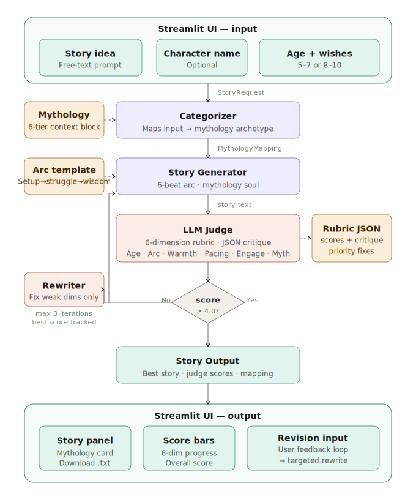

# 🌙 Bedtime Story Teller
### Inspired by Indian Mythology

A bedtime story generation system for children ages 5–10, powered by GPT-4o, 
an LLM judge, and a critique-revise loop — all rooted in the rich tradition 
of Indian narrative wisdom.

---

## How to Run

```bash
pip install -r requirements.txt
cp .env.example .env          # then paste your key inside
streamlit run app.py
```

---

## System Design

### The Pipeline



```
User Input (Streamlit)
    ↓
[Categorizer] — maps request to Indian mythology archetype
    ↓
[Story Generator] — creates story using mythology context + 6-beat arc
    ↓
[LLM Judge] — evaluates on 6 dimensions, returns structured critique
    ↓ (if score < 4.0 and iterations < 3)
[Rewriter] — surgically fixes only the weak dimensions
    ↓
[Judge again] → best version tracked across all iterations
    ↓
Final Story displayed in Streamlit
    ↓
[Optional: User revision request] → one more rewrite pass
```

---

## Prompting & Agent Design Strategies

| Technique | Where | Why |
|---|---|---|
| **Temperature calibration** | All modules | Judge: 0.2 (consistent scoring), Categorizer: 0.4 (accurate mapping), Rewriter: 0.75 (focused), Generator: 0.85 (creative warmth) |
| **Structured JSON output** | Categorizer, Judge | LLM returns typed JSON; code parses into dataclasses. Keeps logic in Python, not prose |
| **System / user role split** | All modules | System prompt = persona + hard rules. User prompt = the specific task. Separating them gives the model a stable identity |
| **Knowledge injection (not RAG)** | Generator | Full 341-line mythology context baked into the system prompt as a rich static block — no vector DB needed at this scale |
| **Surgical critique** | Judge → Rewriter | Judge names only weak dimensions; rewriter is explicitly told which dimensions are working and must not be touched |
| **Best-of-N with bounded iterations** | main.py | Tracks highest-scoring story across all iterations. A rewrite can regress — always returning the best prevents quality from moving backwards |
| **Archetype-driven generation** | Categorizer → Generator | One small, cheap LLM call first shapes the entire story. The categorizer's archetype, tone, wisdom figure, and setting flow into every subsequent prompt |
| **User feedback loop** | app.py + rewriter | After the story is shown, the user can request any change in plain language — a separate rewrite pass handles it without re-running the full pipeline |

---

## Key Design Decisions

### 1. Why Indian Mythology?
Indian mythology contains some of the world's most sophisticated narrative 
engineering — ancient story structures that have resonated across thousands 
of years. The Panchatantra alone is the oldest known collection of fables. 
The Bhagavad Gita contains a complete moral philosophy expressed through 
story. These traditions are rich, public domain, and deeply human — exactly 
what a bedtime story system should draw from.

### 2. The Critique-Revise Loop
The judge doesn't just pass or fail a story. It returns structured JSON 
with per-dimension scores and specific critiques. The rewriter then receives 
only the failing dimensions as its instructions — "fix these, keep everything 
else." This is surgical rather than random regeneration, and meaningfully 
improves story quality over iterations.

### 3. Why a 6-Dimension Rubric?
A binary pass/fail judge tells the rewriter nothing useful. A rubric judge 
tells it exactly what is broken and why. The 6 dimensions — age appropriateness, 
story arc, emotional warmth, pacing, engagement, mythology integrity — cover 
the full quality surface of a good bedtime story.

### 4. Best Score Tracking
The pipeline doesn't return the last story — it returns the best-scoring story 
across all iterations. A rewrite can sometimes make things worse. Tracking the 
best ensures quality always moves in the right direction.

### 5. Mythology as a Knowledge Layer (not RAG)
Rather than retrieving from a vector database, the entire mythology knowledge 
architecture is baked into the generator's system prompt as a rich context 
block. This works well at this scale and ensures consistent, accurate archetype 
mapping without infrastructure overhead.

---

## File Structure

```
├── app.py                      # Streamlit UI
├── main.py                     # Pipeline orchestrator (no UI)
├── categorizer.py              # Mythology archetype mapper
├── generator.py                # Story generator
├── judge.py                    # 6-dimension rubric judge
├── rewriter.py                 # Critique-driven rewriter
├── models/
│   └── story_types.py          # All dataclasses
├── prompts/
│   ├── mythology_context.py    # Full Indian mythology knowledge block
│   ├── categorizer_prompt.py   # Archetype mapping prompt
│   ├── generator_prompt.py     # Story generation prompt + arc template
│   ├── judge_prompt.py         # Rubric evaluation prompt
│   └── rewriter_prompt.py      # Critique-driven rewrite prompt
├── requirements.txt
└── README.md
```

---

## Mythology Coverage

| Tier | Sources |
|------|---------|
| Great Epics | Ramayana, Mahabharata, Bhagavad Gita |
| Gods & Puranas | Ganesha, Young Krishna, Hanuman, Prahlada, Dhruva, Nachiketa, Saraswati |
| Fables | Panchatantra, Jataka Tales, Vikram-Betaal, Hitopadesha |
| Wit & Courts | Akbar-Birbal, Tenali Rama, Gopal Bhar |
| Folk & Devotional | Mirabai, Kabir, Thiruvalluvar, Andal, Tukaram |
| Ancient Wonder | Nalanda, Aryabhata, Ancient trade routes |

---

## What I'd Add With More Time

- **Vector search over full texts** — embed actual Panchatantra and Jataka stories 
  for richer retrieval-augmented generation
- **Illustrated mode** — generate DALL-E images for each story beat
- **Voice output** — text-to-speech for actual bedtime listening
- **Story history** — save and revisit previous stories
- **Multiple languages** — stories in Hindi, Tamil, Telugu, etc.
- **Parent controls** — theme filtering, length preferences
